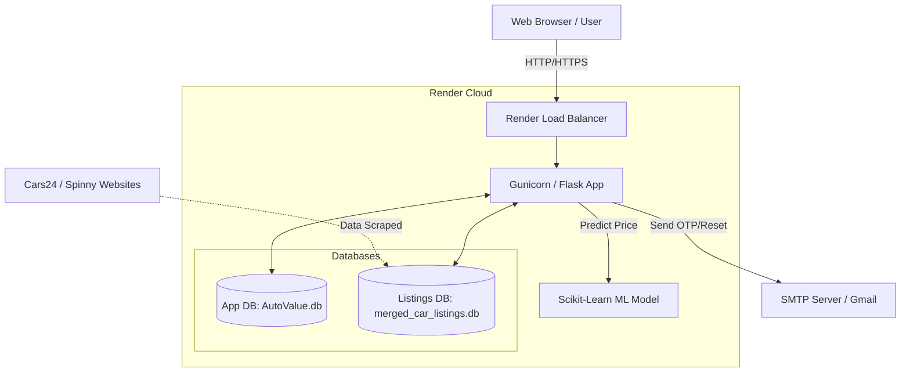
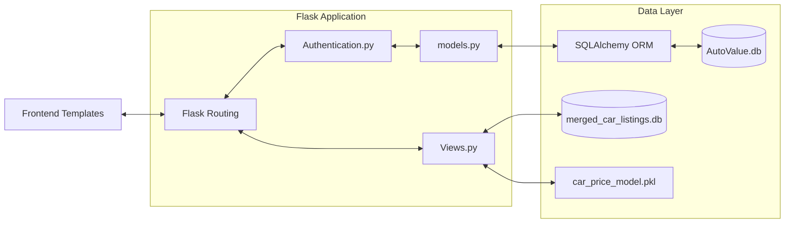
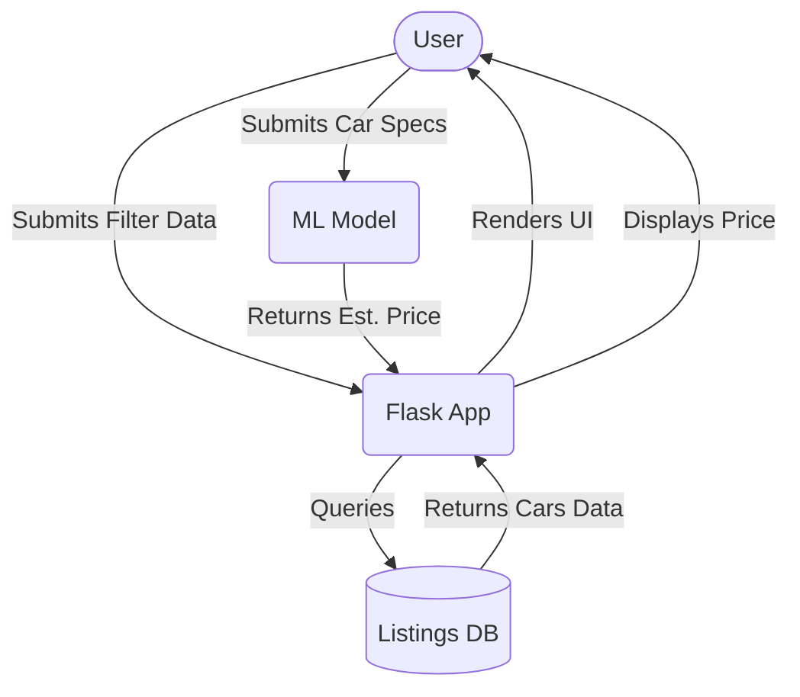
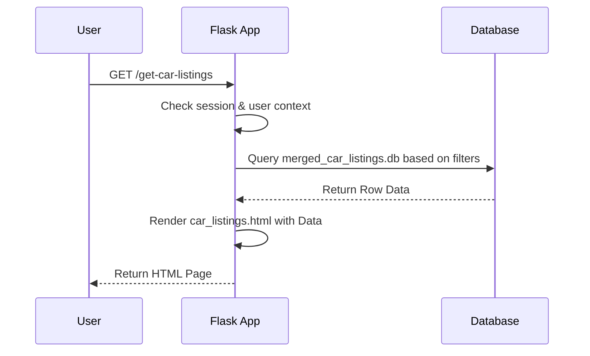
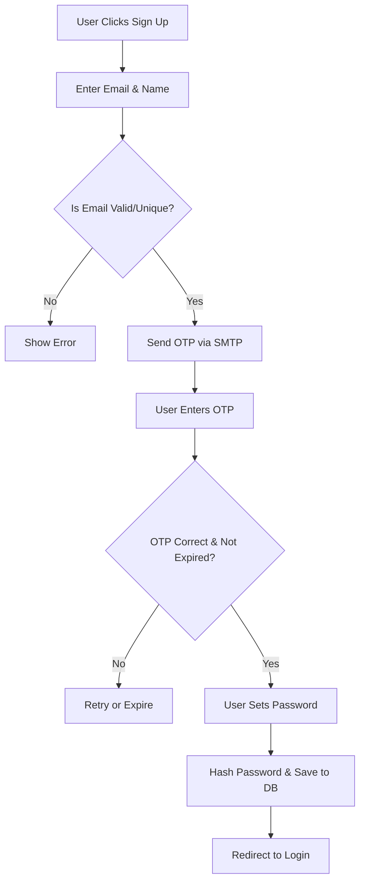
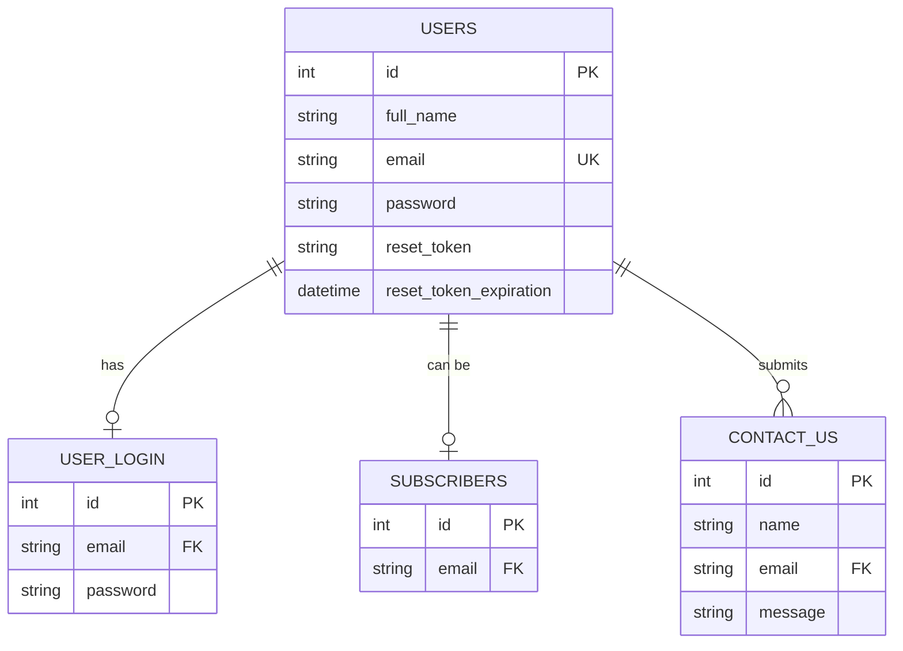

# Auto Value 🚗

[](https://www.python.org/)
[](https://flask.palletsprojects.com/)
[](https://scikit-learn.org/)
[](https://render.com/)

Auto Value is an enterprise-grade web application built with Flask that aggregates used car listings from multiple platforms (Cars24, Spinny, OLX) and provides accurate car price predictions using a trained Machine Learning model. 

## 📑 Table of Contents
- [Features](#-features)
- [Tech Stack](#-tech-stack)
- [Folder Structure](#-folder-structure)
- [Architecture & Diagrams](#-architecture--diagrams)
- [Database Models](#-database-models)
- [Security Implementation](#-security-implementation)
- [Installation & Setup](#-installation--setup)
- [Environment Variables](#-environment-variables)
- [Deployment](#-deployment)
- [License](#-license)

---

## 🚀 Features

- **Advanced Car Price Prediction**: Utilizes a Random Forest Regressor trained on thousands of live car listings to predict accurate used car prices.
- **Aggregated Car Listings**: Browsing, filtering, and searching capabilities for scraped car listings from Cars24 and Spinny.
- **Robust User Authentication**: 
  - Secure sign-up with Email OTP verification.
  - Password hashing and secure login sessions.
  - Password reset workflows via tokenized email links.
- **Automated Data Pipelines**: Scripts for scraping data, downloading images concurrently, and rebuilding the ML model.
- **Responsive UI/UX**: Clean and interactive frontend built with HTML, CSS, and JS (Jinja2).
- **Newsletter & Contact Us**: Integrated forms for user engagement.

---

## 🛠 Tech Stack

- **Backend**: Python, Flask, Flask-SQLAlchemy, Flask-Login
- **Machine Learning**: Scikit-Learn, Pandas, NumPy
- **Database**: SQLite (SQLAlchemy ORM for App Data, native SQLite for scraped data)
- **Frontend**: HTML5, CSS3, JavaScript, Jinja2 Templates
- **Production Server**: Gunicorn
- **Deployment**: Render

---

## 📁 Folder Structure

```text
Auto_Value-main/
├── app.py                      # Application entry point
├── render.yaml                 # Render deployment configuration
├── requirements.txt            # Python dependencies
├── build_model.py              # ML model training script
├── download_images.py          # Script to download missing car images
├── fast_download.py            # Concurrent image downloader
├── scrapers/                   # Data directory for ML and raw listings
│   ├── merged_car_listings.db  # Scraped data SQLite database
│   ├── car_price_model.pkl     # Trained ML pipeline
│   └── *.csv                   # Raw scraped data from Cars24/Spinny
└── website/                    # Main Flask application module
    ├── __init__.py             # App factory and DB initialization
    ├── Authentication.py       # Auth routes (Login, Signup, OTP, Reset)
    ├── Views.py                # Main application routes (Listings, Predict, Blogs)
    ├── models.py               # SQLAlchemy Database Models
    ├── static/                 # CSS, JS, and image assets
    └── templates/              # Jinja2 HTML templates
```

---

## 🏗 Architecture & Diagrams

### 1. High-Level Architecture Diagram


### 2. Component Diagram


### 3. Data Flow Diagram


### 4. Request Lifecycle Diagram


### 5. Authentication Flow Diagram


### 6. Database Relationship Diagram


---

## 🔒 Security Implementation
- **Password Hashing**: Werkzeug's `generate_password_hash` and `check_password_hash`.
- **Session Management**: Handled securely via `Flask-Login` and server-side sessions.
- **OTP Verification**: Time-based (5 minutes expiry) in-memory OTP validation for email ownership verification.
- **Secure Emailing**: SMTP with SSL/TLS context for sending transactional emails (OTP, Password Reset).

---

## ⚙️ Installation & Setup

### Prerequisites
- Python 3.10+
- Git

### Steps

1. **Clone the repository**
   ```bash
   git clone https://github.com/Vrushi0912/Auto_Value.git
   cd Auto_Value/Auto_Value-main
   ```

2. **Set up a virtual environment**
   ```bash
   python -m venv venv
   source venv/bin/activate  # On Windows: venv\Scripts\activate
   ```

3. **Install dependencies**
   ```bash
   pip install -r requirements.txt
   ```

4. **Environment Variables**
   - Rename `.env.example` to `.env`.
   - Update the configuration values (see below).

5. **Run the Application**
   ```bash
   flask run
   ```
   *For production simulation (macOS/Linux):*
   ```bash
   gunicorn app:app
   ```

---

## 🔐 Environment Variables

Create a `.env` file in the root directory (where `app.py` is located) with the following keys:

```env
SECRET_KEY=your_secure_random_secret_key
EMAIL_USER=your_email@gmail.com
EMAIL_PASS=your_email_app_password
```
*(Note: Use a Google App Password for `EMAIL_PASS` if using Gmail.)*

---

## 🚀 Deployment

The project is natively configured for deployment on [Render](https://render.com) using the included `render.yaml`.

1. Fork or clone this repository to your GitHub account.
2. Sign in to Render and create a new **Blueprint** instance.
3. Connect the repository. Render will automatically parse the `render.yaml` file.
4. Set the `SECRET_KEY`, `EMAIL_USER`, and `EMAIL_PASS` environment variables in the Render Dashboard.
5. Deploy the application.

---

## 📄 License
This project is licensed under the MIT License.
